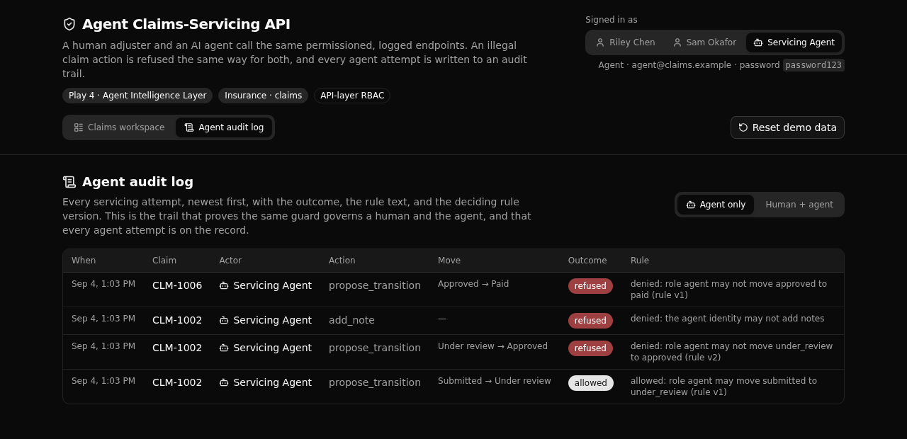

# Agent Claims-Servicing API

A governed insurance claims API where a human adjuster and an AI agent call the same permissioned, logged endpoints. An illegal claim action is refused the same way for both, and every agent attempt is written to an audit trail.



## What it demonstrates

This is a Play 4 (Agent Intelligence Layer) proof for insurance claims servicing. The rules that govern a claim live in ONE API layer, and they are enforced the same way for a person and for an agent.

One shared function, `enforce_transition`, is the only place a claim's status ever changes. Both the human endpoint and the agent endpoint call it. So a legal move succeeds and an illegal move is refused with the exact rule version that decided it, no matter who asked. Every attempt, allowed or refused, is written to a readable audit log tagged with whether a person or the agent made it.

An evaluator cares because the governing logic is not scattered across clients or copied into the agent. It is one auditable rule set a technical reader can point at and trust, and the agent is held to it exactly as a human is.

The state machine is data, not code branches. A `transition_rule` row says which roles may move a claim from one status to another, at a version. The set is versioned, so a policy can tighten over time (v1 let handlers approve, v2 restricts approval to supervisors) while the change stays auditable and the deciding version rides on every decision.

**5 tables · 8 APIs · 1 shared function · 1 AI agent.**

## Repo layout

```
xano/
  index.ts                          registers everything onto the workspace
  tables/                           adjuster, claim, transition_rule, claim_note, claim_action
  functions/enforce_transition.ts   the ONE guard both the human and agent paths call
  agents/claim_interpreter.ts       reads an instruction into a target status (xano-free, no key)
  api/                              seed, login, list, get, propose-transition, add-note, actions, agent/service-claim
frontend/                           React + Vite + Tailwind v4 + shadcn/ui
  src/lib/api.ts                    the one contract: paths and types come from the query defs
docs/                               this landing page and the screenshot above
```

## API surface

Every endpoint lives in the `claims` API group, so paths read `/api:claims/<name>`.

| Verb | Path | What it enforces |
| --- | --- | --- |
| POST | `/api:claims/seed/reset` | Public. Wipes and repopulates the demo: adjusters, the versioned rule set, claims across statuses, and a pre-walked audit trail. |
| POST | `/api:claims/login` | Public. Checks a credential and mints a bearer token, for a human or the agent identity alike. |
| GET | `/api:claims/list` | Any signed-in identity. Lists claims with status and assignment. |
| GET | `/api:claims/get/{claim_id}` | Any signed-in identity. One claim with its notes and its full audit trail. |
| POST | `/api:claims/propose-transition` | The human path. Hands the move to the shared guard, attributed to the caller. |
| POST | `/api:claims/add-note` | Role-guarded. A human may add a note; the agent identity is refused, and the refusal is logged. |
| GET | `/api:claims/actions` | The audit log, newest first, filterable by `actor_kind`. |
| POST | `/api:claims/agent/service-claim` | The agent path. Interprets an instruction, then runs the SAME guard as the agent identity. |

Auth is API-layer role-based access control: an auth table plus per-endpoint guards. Permissions are checked at the endpoint, never at the row.

## Quick start

You need Node 20.19+ and a free Xano account.

```sh
git clone https://github.com/xano-scratch/agent-claims-servicing-api
cd agent-claims-servicing-api
npm install
npx xanots login       # one-time browser auth with Xano
npm run xano:deploy    # builds the frontend, deploys the backend, prints a live URL
```

The deploy ships to a fresh, auto-expiring environment and injects its URL into the frontend, so the app is live with no extra config. Open the printed URL, sign in as the handler, the supervisor, or the agent (the seeded password is shown in the app), and drive the demo.

To seed data on a running environment, call `POST /api:claims/seed/reset`, or click "Reset demo data" in the app.

## Try the governed guard

1. Sign in as the handler and propose moving a submitted claim to under review. It is allowed (rule v1).
2. As the handler, propose moving an under-review claim to approved. It is refused, citing rule v2 (approval was tightened to supervisors).
3. Sign in as the supervisor and make the same approve move. It is allowed under v2.
4. Open "Ask the agent", give a plain instruction like "advance this claim to approved", and watch the agent get the same refusal a handler got, with the attempt written to the log.
5. Open the agent audit log to see every agent attempt, its outcome, and the rule that fired.

## FAQ

**Where does the business logic live?**
In `xano/functions/enforce_transition.ts`. It is the only writer of a claim's status, and both the human and agent endpoints call it, so there is one rule set to read and audit.

**How is the agent held to the same rules?**
The agent endpoint interprets an instruction into a target status, then calls the exact same guard function, attributed to the agent identity. The agent never decides its own permission.

**Does the agent need an API key?**
No. It runs on Xano's keyless `xano-free` provider, so the whole demo deploys and runs on seed data with no external credentials.

**Is this a production reference?**
No. It is a scratch proof artifact with seeded demo data, meant to be read and run.

## License

MIT.
